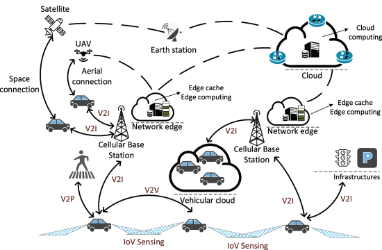
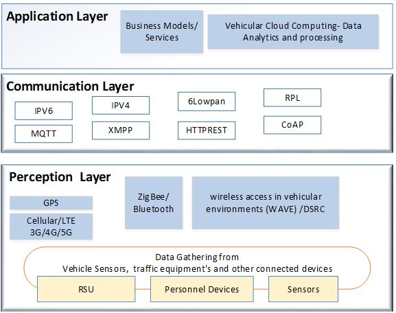

# Blockchain for the Internet of Vehicles

## Motivation and Need
Internet-of-Vehicles (IoV) considered to be the evolution of Vehicular AdHoc Network (VANET) connects Vehicles (V) to Everything (X) around it. Everything could include 
vehicles, sensors, pedestrians, mobile devices, and the Internet with advanced communication and networking technologies, with main focus and aim to enhance road 
safety, improve road traffic management, and support immerse user experience. With the increased complexity of the vehicles architecture and the modern road infrastructures 
along with other IoV devices and high vehicle mobility pose has a huge challenge.

- V2V ⇒ Vehicle to Vehicle 
- V2I ⇒ Vehicle to Infrastructure 
- V2P ⇒ Vehicle to Pedestrian 
- V2N ⇒ Vehicle to Network
- V2D ⇒ Vehicle to Device 
- V2G ⇒ Vehicle to Grid 
- V2C ⇒ Vehicle to Cloud 

## Introduction 

## Literature  Survey and Current Status

Akram Hakiri et.al proposed a novel blockchain-based architecture that leverages SDN and NFV for securing IoT transactions. The paper proposed two important aspects,
Security appliance is introduced in form of Virtualized Network Function for improving the scalability and performance of IoT networks; a novel consensus algorithm
to mitigate malicious traffic by detection and reporting suspected IoT/IoV nodes. The work also considers the expected grwoth of 5G network which shall allow low-power massive 
IoT devices to produce high volumes of data that can be transmitted over ultra-reliable, low-latency wireless communication services. 

  </img>  
  <h6 align="center"> Fig. 1 - IoV Ecosystem [2] </h6>

  

  </img>  
  <h6 align="center"> Fig. 2 - IoV Ecosystem [5] </h6>

## Discussions

## Future Scope and Research Gaps

## Outcome of this Study

## References 
**[1]** [Ramaguru R., Sindhu M., Sethumadhavan M.]() (2019) **Blockchain for the Internet of Vehicles.** In: Singh M., Gupta P., Tyagi V., Flusser J., Ören T., Kashyap R. (eds) _Advances in Computing and Data Sciences. ICACDS 2019._ Communications in Computer and Information Science, vol 1045. Springer, Singapore. 
 [https://doi.org/10.1007/978-981-13-9939-8_37](https://doi.org/10.1007/978-981-13-9939-8_37)   
**[2]** [W. Zhuang, Q. Ye, F. Lyu, N. Cheng and J. Ren,]() "**SDN/NFV-Empowered Future IoV With Enhanced Communication, Computing, and Caching,**" 
    in _Proceedings of the IEEE_, vol. 108, no. 2, pp. 274-291, Feb. 2020, doi: 10.1109/JPROC.2019.2951169.   
**[3]** [Akram Hakiri and Behnam Dezfouli.]() 2021.** Towards a Blockchain-SDN Architecture for Secure and Trustworthy 5G Massive IoT Networks. **
    In _Proceedings of the 2021 ACM International Workshop on Software Defined Networks & Network Function Virtualization Security (SDN-NFV Sec'21)._ 
    Association for Computing Machinery, New York, NY, USA, 11–18. [https://doi.org/10.1145/3445968.3452090](https://doi.org/10.1145/3445968.3452090)   
**[4]** [Abbas, M.T., Muhammad, A. & Song, WC.]() **SD-IoV: SDN enabled routing for internet of vehicles in road-aware approach.** _J Ambient Intell Human Comput_ 11, 1265–1280 (2020). [https://doi.org/10.1007/s12652-019-01319-w](https://doi.org/10.1007/s12652-019-01319-w)   
**[5]** Thinkpalm. **How Can The Automotive Industry Leverage Internet of Vehicles (IoV) to Build Next Gen Connected Cars. **
    [https://thinkpalm.com/blogs/internet-of-vehicles-iov-to-build-next-gen-connected-cars/](https://thinkpalm.com/blogs/internet-of-vehicles-iov-to-build-next-gen-connected-cars/)
