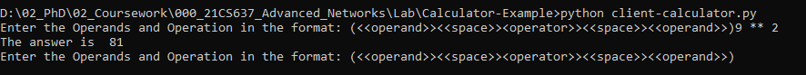

# Client and Server Socket Programming

## Windows - Single Machine

### Remote Calculator
#### Server

#### Client

### Quiz System
#### Server

#### Client

## Ubuntu - Multiple Virtual Machines (VM)

### Remote Calculator
#### Server

#### Client

### Quiz System
#### Server

#### Client

