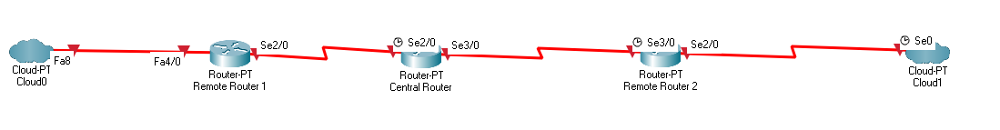

# Cisco DiffServ QoS

## Background
Six bits of the DS field are used as the ifferentiated services code point (DSCP) to select the Per-Hop Behavior (PHB) at each interface. A currently unused 2-bit (CU) field is reserved for explicit congestion notification (ECN). The value of the CU bits is ignored by DS-compliant interfaces when determining the PHB to apply to a received packet.

Per-Hop Behavior (PHB) refers to the packet scheduling, queueing, policing, or shaping behavior of a node on any given packet belonging to a Behavior Aggregate (BA), as configured by a service level agreement (SLA) or a policy map.

### Default PHB
DSCP value is **000000** (0)

### Class-Selector PHB

DSCP value in the form **xxx000**, where x is either 0 or 1. This is to ensure backward compatibility.

### Assured Forwarding PHB
In AF, network traffic can be divided into the following classes:

- Gold: Traffic is allocated 50% of the available BW.
- Silver: Traffic is allocated 30% of the available BW.
- Bronze: Traffic is allocated 20% of the available BW.

DSCP value, **xyzab0**, where xyz (4 classes) can be 001, 010, 011,  or 100, and ab (3 precedence) represents the dP value.dP is the probability for dropping the packet.

dP(AF13) >= dP (AF12) >= dP(AF11)

### Expedited Forwarding PHB

Applications such as Voice over IP (VoIP), video, require guaranteed BW robust service.

DSCP value is **101110** (46)

## Demo Setup

    

| Traffic Class | Traffic Type | DSCP Value | 
|---------------|--------------|:----------:|
|   Premium     |    Voice     |     46     |
|    Gold       |   Terminal Access Controller Access Control System (TACACS)   |     10     | 
|   Silver      |   Telnet     |     18     |
|   Silver      |    Simple Mail Transfer Protocol (SMTP)      |     20     |
|   Silver      |    File Transfer Protocol (FTP)     |     22     |
|   Bronze      |    Hyper Text Transfer Protocol (HTTP)      |     26     |

**Class-map:** a network traffic classification.
**Policy-map:** a series of actions that will be applied to a set of classified inbound traffic.

