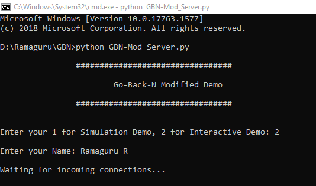
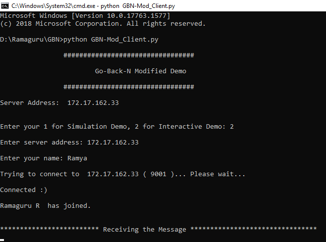
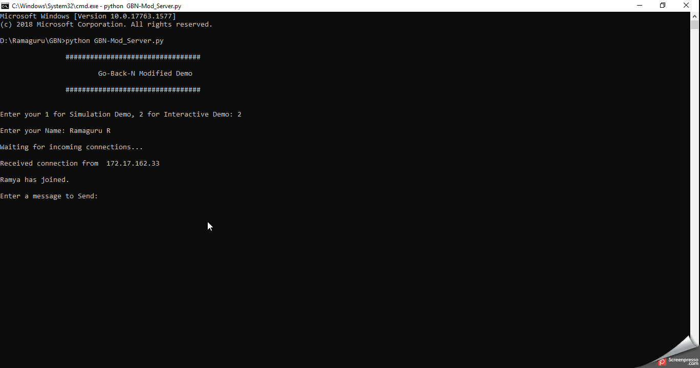

# Go-Back-N Algorithm 

## Basic Version

## Modified Version

### Server (Code)

```
# Go-Back-N Modified Demo
# Author : Ramaguru Radhakrishnan
# Description : GBN Modified 
# Assignment : 21CS637 - Advanced Networks
# execute as "python GBN-Mod_Server.py"

import time, socket, sys

# Constants
sleepTimer = 1
port = 9001
bufferSize = 1024 
winSize = 18
verbose = 1
debug = 1
loopCounter = 1

# Global Variables
name = ""
msg = ""
recMsg = ""

'''
Function to convert Decimal to Binary
'''
def decToBin(dec):  
    return dec.replace("0b", "")

'''
Function to convert Decimal to Binary
'''
def binCode(strMsg):
    byteArr = bytearray(strMsg, "utf8")

    byteList = []

    for byte in byteArr:
        binRep = bin(byte)
        byteList.append(decToBin(binRep))
        
    binc = ""
    for i in byteList:
        binc += i
    return binc

# Program Header
print("\n\t\t#################################\n")
print("\t\t\tGo-Back-N Modified Demo\t\t\n")
print("\t\t#################################\n")
time.sleep(sleepTimer)

# Socker Definition and Connection
server = socket.socket()
host = socket.gethostname()
ip = socket.gethostbyname(host)
server.bind((host, port))

# Ask the user for Demo Mode
typeRun = int(input(str("\nEnter your 1 for Simulation Demo, 2 for Interactive Demo: ")))

# Set the parameters based on user selection
if(typeRun == 1):
    name = "Ramaguru"
    msg = "GBN-B"
    print("\nMessage for Interactive Demo will be \"",msg,"\" with a Window Size of", winSize ,"from username", name );
if(typeRun == 2):
    name = input(str("\nEnter your Name: "))
           
server.listen(10)
print("\nWaiting for incoming connections...")
conn, addr = server.accept()
print("\nReceived connection from ", addr[0], "\n")

s_name = conn.recv(bufferSize).decode()
print(s_name, "has joined.")
conn.send(name.encode())

# Start the loop
while loopCounter<=1:

    if(typeRun == 2):
        msg = input(str("\nEnter a message to Send: "))
        
    conn.send(msg.encode())
    
    # Convert the message to Binary String
    msg = binCode(msg)
    
    print("\nMessage to be transmitted is ", msg)
    
    lenmsg = str(len(msg))
    conn.send(lenmsg.encode())
    length = int(lenmsg)
    
    # Acknowledgement Counter is set to 0
    ackCounter = 0
    
    if(typeRun == 2):
        winSize = int(input("\nEnter the Window Size:")) - 1
    
    # Stop the loop after 1 iteration for Simulation Demo
    if(typeRun == 1):
        loopCounter +=1
        
    slideWindow = winSize    
    
    print("\n************************************** Starting the Message Transmission *****************************************")
    
    while ackCounter!=length:
        # verbose message
        if(verbose==1):
            print("\nVERBOSE:- Acknowledgement Counter:", ackCounter, " & Length:", length)
            
        while(ackCounter!=(length-winSize)):
            # verbose message
            if(verbose==1):
                print("W1: Message Size (",length-ackCounter,") is larger than Window Size (",winSize,")")
             
            if(debug==1):
                print("DEBUG: ", msg[ackCounter].encode() )    
            conn.send(msg[ackCounter].encode())
            recMsg = conn.recv(bufferSize).decode()
            print("------------------------------------------------------------------------------------------------------------------\nReceived:", recMsg)
            
            if(recMsg!="ACK Lost"):
                time.sleep(sleepTimer)
                print("Response: ACK RECEIVED! Sliding Window moves to " + (str(ackCounter+1)) + " to " + str(slideWindow+1) + ". Send NXT PKT.")
                
                # Increment the Acknowledgement Counter and the Sliding Window
                ackCounter += 1
                slideWindow += 1
                time.sleep(sleepTimer)
            else:
                time.sleep(sleepTimer)
                print("Response: ACK LOST! Sliding Window in " + (str(ackCounter+1)) + " to " + str(slideWindow+1) + ". ReSend PKT.")
                time.sleep(sleepTimer)
                
        while(ackCounter!=length):
            # verbose message
            if(verbose==1):
                print("W2: Message Size (",length-ackCounter,") is lesser than Window Size (",winSize,")")
                
            conn.send(msg[ackCounter].encode())
            recMsg = conn.recv(bufferSize).decode()
            print("------------------------------------------------------------------------------------------------------------------\nReceived:", recMsg)
            
            if(recMsg!="ACK Lost"):
                time.sleep(sleepTimer)
                print("Response: ACK RECEIVED! Sliding Window moves to " + (str(ackCounter+1)) + " to " + str(slideWindow) + ". Send NXT PKT.")
                # Increment the Acknowledgement Counter
                ackCounter += 1
                time.sleep(sleepTimer)
            else:
                time.sleep(sleepTimer)
                print("Response: ACK LOST! Sliding Window in " + (str(ackCounter+1)) +" to "+ str(slideWindow) + ". ReSend PKT.")
                time.sleep(sleepTimer)
```

### Client (Code)

```
# Go-Back-N Modified Demo
# Author : Ramaguru Radhakrishnan
# Description : GBN Modified 
# Assignment : 21CS637 - Advanced Networks
# execute as "python GBN-Mod_Client.py"

import time, socket, sys
import random

# Constants
sleepTimer = 1
port = 9001
bufferSize = 1024
verbose = 1
debug = 1

# Global Variables
name = ""
host = ""

# Program Header
print("\n\t\t#################################\n")
print("\t\t\tGo-Back-N Modified Demo\t\t\n")
print("\t\t#################################\n")
time.sleep(sleepTimer)

# Socker Definition and Connection
client = socket.socket()
shost = socket.gethostname()
ip = socket.gethostbyname(shost)
print("Server Address: ",ip,"\n")

# Ask the user for Demo Mode
typeRun = int(input(str("\nEnter your 1 for Simulation Demo, 2 for Interactive Demo: ")))

# Set the parameters based on user selection
if(typeRun == 1):
    host = ip
    name = "Ramya"
    print("\nDetails for Interactive Demo will be host \"",ip,"\" with username", name);
if(typeRun == 2):
    host = input(str("\nEnter server address: "))
    name = input(str("\nEnter your name: "))

print("\nTrying to connect to ", host, "(", port, ")... Please wait...\n")
time.sleep(sleepTimer)
client.connect((host, port))
print("Connected :)\n")

client.send(name.encode())
s_name = client.recv(bufferSize).decode()
print(s_name," has joined.\n")

print("\n************************* Receiving the Message ********************************")

# Start the loop
while True:
    originalMsg = client.recv(bufferSize).decode()
    length = int(client.recv(bufferSize).decode())
    ackCounter = 0
    msgToBeSent = ""
    message = ""
    conMsg = ""
    
    while ackCounter!=length:
       # Randomly Select the message acceptance [0 - LOST, 1 - RECEIVED]
       randSelect = random.randint(0,1)
       # verbose message
       if(verbose==1):
          print("--------------------------------------------------------------------------")
          print("\nVERBOSE:- Acknowledgement Counter:", ackCounter)
       # debug message
       if(debug==1):
          print("\nDEBUG:- Random:", randSelect)
        
       # Send ACK LOST
       if(randSelect==0):
          msgToBeSent = "ACK Lost"
          message = client.recv(bufferSize).decode()
          if(debug==1):
            print("\nDEBUG:- Received bit:", message)
          client.send(msgToBeSent.encode())
       # Send ACK #
       elif(randSelect==1):
          msgToBeSent = "ACK "+ str(ackCounter)
          message = client.recv(bufferSize).decode()
          if(debug==1):
            print("\nDEBUG:- Received bit:", message)
          client.send(msgToBeSent.encode())
          # Construct the Binary Message
          conMsg += message
          # Increment the Acknowledgement Counter
          ackCounter += 1
          
    print("\nReceived Message from Server :", originalMsg, " and Reconstructed Binary Data : ", conMsg)
   

```

### Demo 

#### Server Init

<p align="center">
  
</p>

#### Client Init

<p align="center">
  
</p>

#### Data Transmission and Reception

<p align="center">
  
</p>
