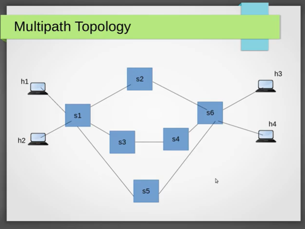

# SDN Load Balancer

## Topology 

<p align="center">
  </img>
</p>

## Mininet Topology 
```
#!/usr/bin/python

# Author: Ramaguru Radhakrishnan
# Updated Date : Jan - 2022
# Network Topology as shown in the YouTube Video on/for Multipath Load Balancing
# Assignment : SDN - RYU Framework - Advanced Networks

from mininet.net import Mininet
from mininet.node import Controller, RemoteController
from mininet.cli import CLI
from mininet.log import setLogLevel, info
from mininet.topo import Topo

class loadBalancerTopo( Topo ):
    def build( self ):

	print "*** Adding Controllers"

	ODL_CONTROLLER_IP = "10.0.0.6"

	FDL_CONTROLLER_IP = "10.0.0.7"

	net = Mininet (topo= None, build = False)

	print "*** Adding Hosts"

	h1 = net.addHost( 'h1' )
	h2 = net.addHost( 'h2' )
	h3 = net.addHost( 'h3' )
	h4 = net.addHost( 'h4' )

	print "*** Adding Switches"

	s1 = net.addSwitch ( 's1' )
	s2 = net.addSwitch ( 's2' )
	s3 = net.addSwitch ( 's3' )
	s4 = net.addSwitch ( 's4' )
	s5 = net.addSwitch ( 's5' )
	s6 = net.addSwitch ( 's6' )

	print "*** Adding Links"
	print "( h1, s1 ),"
	net.addLink( h1, s1 )
	print "( h2, s1 ),"
	net.addLink( h2, s1 )
	print "( h3, s6 ),"
	net.addLink( h3, s6 )
	print "( h4, s6 ),"
	net.addLink( h4, s6 )
	print "( s1, s2 ),"
	net.addLink( s1, s2 )
	print "( s1, s3 ),"
	net.addLink( s1, s3 )
	print "( s1, s5 ),"
	net.addLink( s1, s5 )
	print "( s2, s6 ),"
	net.addLink( s2, s6 )
	print "( s3, s4 ),"
	net.addLink( s3, s4 )
	print "( s4, s6 ),"
	net.addLink( s4, s6 )
	print "( s5, s6 )"
	net.addLink( s5, s6 )

	ctrl = net.addController( 'c0', controller = RemoteController, ip = FDL_CONTROLLER_IP, port = 6633)
	# ctrl = net.addController( 'c0', controller = RemoteController, ip = OLD_CONTROLLER_IP, port = 6633)

	print "*** Starting Controller"
	print "c0"
	net.build()

	print "*** Starting Switches"
	s1.start([ctrl])
	s2.start([ctrl])
	s3.start([ctrl])
	s4.start([ctrl])
	s5.start([ctrl])
	s6.start([ctrl])

	# To Print the Configuration
	s1.cmdPrint("ovs-vsctl show")
	s2.cmdPrint("ovs-vsctl show")
	s3.cmdPrint("ovs-vsctl show")
	s4.cmdPrint("ovs-vsctl show")
	s5.cmdPrint("ovs-vsctl show")
	s6.cmdPrint("ovs-vsctl show")

	CLI(net)
	net.stop()

topos = { 'myNetTopology': ( lambda: loadBalancerTopo() ) }	
```

## RYU SDN Load Balancer

```

```

# Reference
- [SDN Training Online. SDN Project - Multipath Load balancing in Software Defined Networking (Mininet, RYU SDN Controller)](https://www.youtube.com/watch?v=XBIR88qnLoA)
