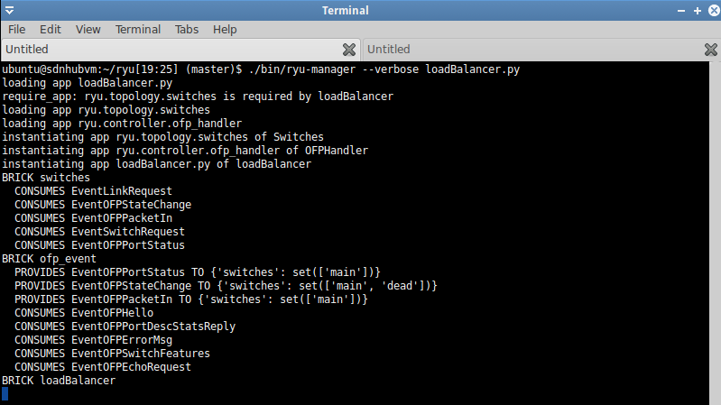

# SDN Load Balancer

## Topology 

<p align="center">
  </img>
</p>

## Mininet Topology 
```
#!/usr/bin/python

# Author: Ramaguru Radhakrishnan
# Updated Date : Jan - 2022
# Network Topology as shown in the YouTube Video on/for Multipath Load Balancing
# Assignment : SDN - RYU Framework - Advanced Networks

from mininet.net import Mininet
from mininet.node import Controller, RemoteController
from mininet.cli import CLI
from mininet.log import setLogLevel, info
from mininet.topo import Topo

class loadBalancerTopo( Topo ):
    def build( self ):

	print "*** Adding Hosts"

	h1 = self.addHost( 'h1' )
	h2 = self.addHost( 'h2' )
	h3 = self.addHost( 'h3' )
	h4 = self.addHost( 'h4' )

	print "*** Adding Switches"

	s1 = self.addSwitch ( 's1' )
	s2 = self.addSwitch ( 's2' )
	s3 = self.addSwitch ( 's3' )
	s4 = self.addSwitch ( 's4' )
	s5 = self.addSwitch ( 's5' )
	s6 = self.addSwitch ( 's6' )

	print "*** Adding Links"
	print "( h1, s1 ),"
	self.addLink( h1, s1 )
	print "( h2, s1 ),"
	self.addLink( h2, s1 )
	print "( h3, s6 ),"
	self.addLink( h3, s6 )
	print "( h4, s6 ),"
	self.addLink( h4, s6 )
	print "( s1, s2 ),"
	self.addLink( s1, s2 )
	print "( s1, s3 ),"
	self.addLink( s1, s3 )
	print "( s1, s5 ),"
	self.addLink( s1, s5 )
	print "( s2, s6 ),"
	self.addLink( s2, s6 )
	print "( s3, s4 ),"
	self.addLink( s3, s4 )
	print "( s4, s6 ),"
	self.addLink( s4, s6 )
	print "( s5, s6 )"
	self.addLink( s5, s6 )


topos = { 'myNetTopology': ( lambda: loadBalancerTopo() ) }	
```

## RYU SDN Load Balancer

```
#!/usr/bin/python

# Author: Ramaguru Radhakrishnan
# Updated Date : Jan - 2022
# SDN-RYU Load Balancer 
# Reference : Youtube Video as shown in Reference Section. 
# Assignment : SDN - RYU Framework - Advanced Networks

from ryu import app
from ryu.base import app_manager
from ryu.controller import ofp_event
from ryu.controller.handler import CONFIG_DISPATCHER, MAIN_DISPATCHER
from ryu.controller.handler import set_ev_cls
from ryu.ofproto import ofproto_v1_3
from ryu.lib.packet import packet
from ryu.lib.packet import ethernet
from ryu.lib.packet import ether_types
from ryu.ofproto import ether
from ryu.lib.packet import ipv4
from ryu.lib.ovs import bridge
from ryu.lib.packet import in_proto
from ryu.lib.packet import icmp
from ryu.lib.packet import tcp
from ryu.lib.packet import udp
from ryu.lib import hub
import networkx as nx
from ryu.topology import event, switches
from ryu.topology.api import get_switch, get_link

INTERVAL = 10

DISCOVER_INTERVAL = 30
TOPOLOGY_DISCOVERED = 0

ALGO = 2 # [1: Random, 2: Shortest Path First, 3: Round Robin]

class loadBalancer(app_manager.RyuApp):
     OFP_VERSIONS = [ofproto_v1_3.OFP_VERSION]

     def __init__(self, *args, **kwargs):
        super(loadBalancer, self).__init__(*args, **kwargs)
        
```

### Demo

<p align="center">
	
</p>	

# Reference
- [SDN Training Online. SDN Project - Multipath Load balancing in Software Defined Networking (Mininet, RYU SDN Controller)](https://www.youtube.com/watch?v=XBIR88qnLoA)
