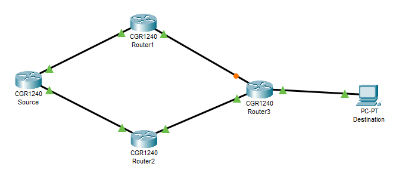
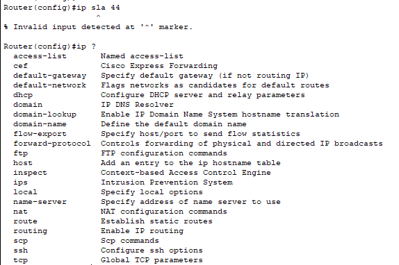

# IP SLA Router Configuration for ICMP

## Background 

IP Service Level Agreement (SLA) for Internet Control Message Protocol (ICMP) Echo operation to monitor end-to-end response time between a Cisco router and devices
using IPv4 or IPv6. ICMP Echo is useful for troubleshooting network connectivity issues. 

## Demo Setup in Packet Tracer

    

### Error

    

# References
- [Cisco IP SLA Router Configuration](https://www.cisco.com/c/en/us/td/docs/ios-xml/ios/ipsla/configuration/15-mt/sla-15-mt-book/sla_icmp_echo.html)
- [IP SLA using GNS3](https://www.youtube.com/watch?v=jYT_d2sHT-8)
