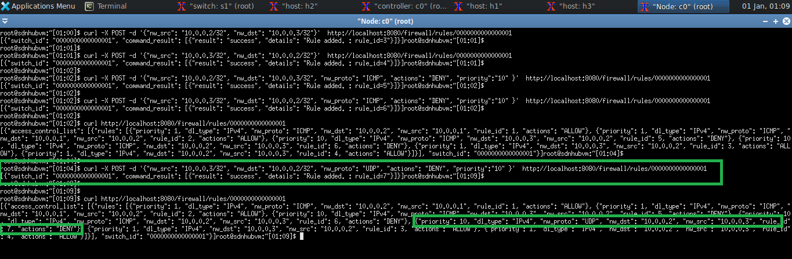
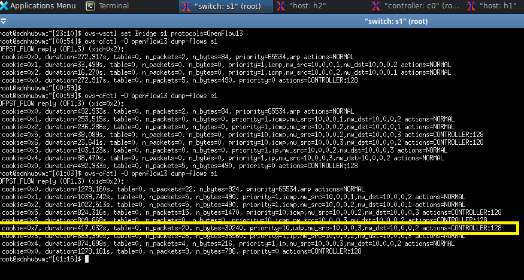
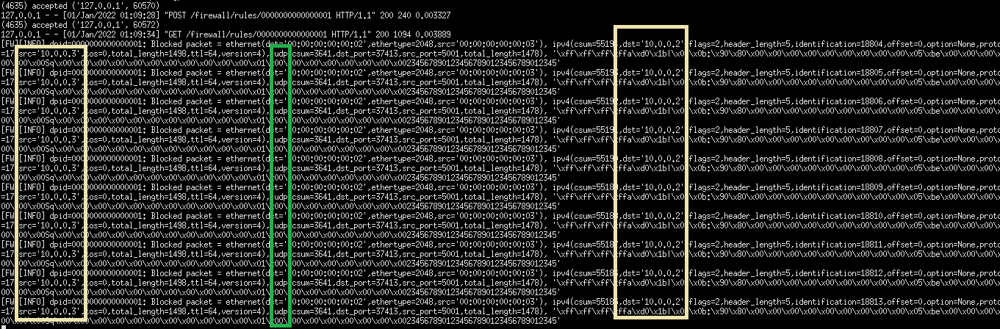

# SDN Firewall 

### Firewall Rule to DENY "UDP" packets
#### Adding a Rule to Firewall
```
curl -X POST -d '{"nw_src": "10.0.0.2/32", "nw_dst": "10.0.0.3/32"}' http://localhost:8080/firewall/rules/0000000000000001

 [
    {
      "switch_id": "0000000000000001",
      "command_result": [
        {
          "result": "success",
          "details": "Rule added. : rule_id=3"
        }
      ]
    }
  ]

```

#### Adding Firewall Rule to Block UDP Packets with Priority 10

```
curl -X POST -d  '{"nw_src": "10.0.0.3/32", "nw_dst": "10.0.0.2/32", "nw_proto": "UDP", "actions": "DENY", "priority": "10"}' http://localhost:8080/firewall/rules/0000000000000001

  [
    {
      "switch_id": "0000000000000001",
      "command_result": [
        {
          "result": "success",
          "details": "Rule added. : rule_id=7"
        }
      ]
    }
  ]
```



### UDP Rule Set in Switch

<p align="center">
  
</p>

### Messages blocked by the SDN Controller

<p align="center">
  
</p>

## Reference
- [REST Firewall. RYU Book](https://osrg.github.io/ryu-book/en/html/rest_firewall.html)
