# Satellite Communication

Earth to Moon. 

<p align="center">
    
</p>

The time for data to travel from earth to the moon is: 385,000,000 (m) / 300000000 (m/s) = 1.28333 (s). <br/>
So the minimum RTT is 1.2833 ∗ 2 = 2.56666 seconds.

## Tools Used 
- tc
- ipref3

### LFN Network 

#### Case 1

| Parameter |  Value |
|-----------|--------|
| Speed     | 10Gbps |
| Loss & Delay | 10% & 100 ms |

```
sudo tc qdisc add dev lo root handle 1: netem delay 100ms loss 10% 
```
<p align="center">
  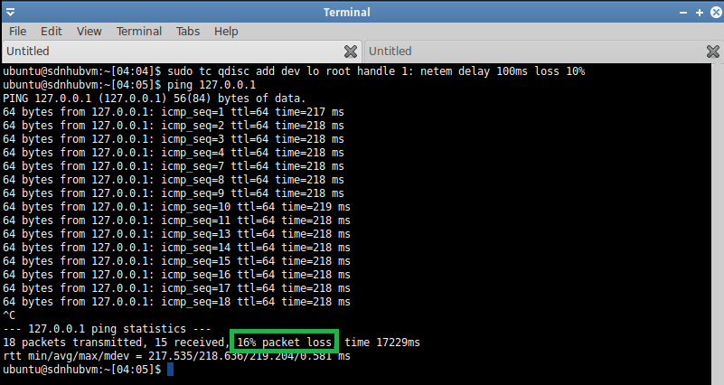  
</p>

```
sudo tc qdisc add dev lo parent 1: handle 2: tbf rate 10gbit burst 1000000 limit 2500000
sudo tc qdisc show dev lo
qdisc netem 1: root refcnt 2 limit 1000 delay 100.0ms loss 10%
qdisc tbf 2: parent 1: rate 10000Mbit burst 1000000b lat 1.2ms 

```

<p align="center">
  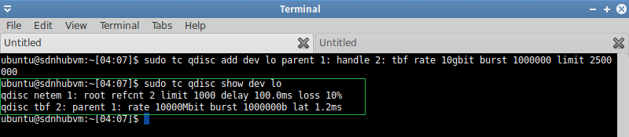  
</p>

<p align="center">
    
</p>

<p align="center">
  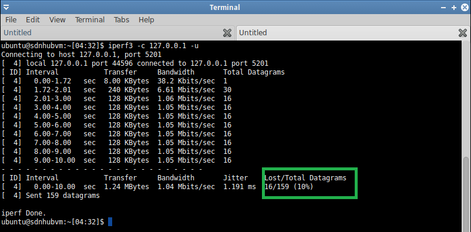  
</p>

#### Case 2

| Parameter |  Value |
|-----------|--------|
| Speed     | 10Gbps |
| Loss & Delay | 50% & 200 ms |

```
sudo tc qdisc add dev lo root handle 1: netem delay 200ms loss 50% 
```
<p align="center">
  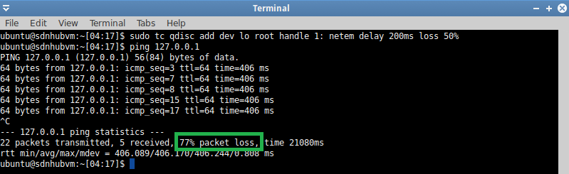  
</p>

```
sudo tc qdisc add dev lo parent 1: handle 2: tbf rate 10gbit burst 1000000 limit 2500000
sudo tc qdisc show dev lo
qdisc netem 1: root refcnt 2 limit 1000 delay 200.0ms loss 50%
qdisc tbf 2: parent 1: rate 10000Mbit burst 1000000b lat 1.2ms 

```

<p align="center">
  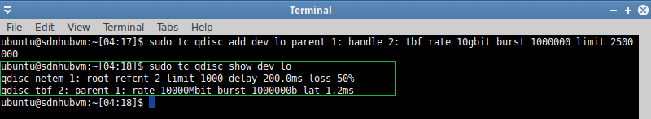  
</p>

<p align="center">
  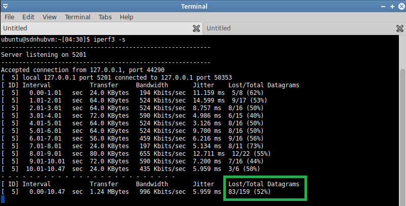  
</p>

<p align="center">
  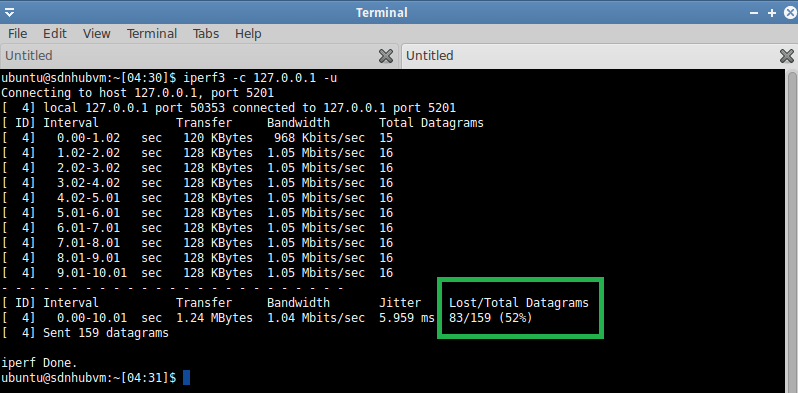  
</p>

### Fast Ethernet 

#### Case 1

| Parameter |  Value |
|-----------|--------|
| Speed     | 100Mbps |
| Loss & Delay | 10% & 100 ms |

```
sudo tc qdisc add dev lo root handle 1: netem delay 100ms loss 10% 
```
```
sudo tc qdisc add dev lo parent 1: handle 2: tbf rate 100mbit burst 1000000 limit 2500000
qdisc netem 1: root refcnt 2 limit 1000 delay 100.0ms loss 10%
qdisc tbf 2: parent 1: rate 100000Kbit burst 1000000b lat 120.0ms
```
<p align="center">
  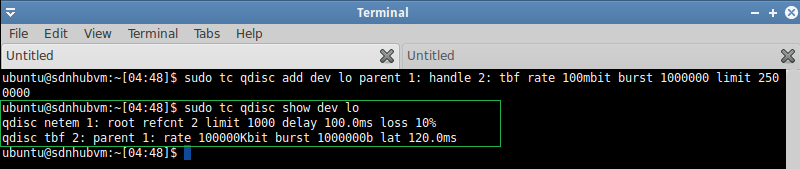  
</p>

<p align="center">
  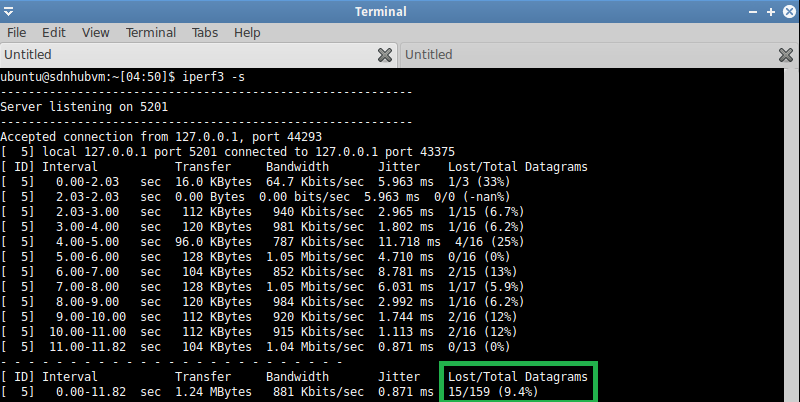  
</p>

<p align="center">
  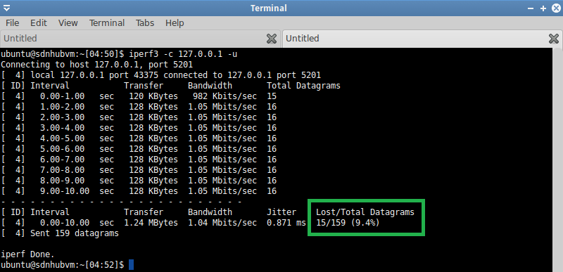  
</p>

#### Case 2

| Parameter |  Value |
|-----------|--------|
| Speed     | 100Mbps |
| Loss & Delay | 50% & 200 ms |

```
sudo tc qdisc add dev lo root handle 1: netem delay 200ms loss 50% 
```

```
sudo tc qdisc add dev lo parent 1: handle 2: tbf rate 100mbit burst 1000000 limit 2500000
qdisc netem 1: root refcnt 2 limit 1000 delay 200.0ms loss 50%
qdisc tbf 2: parent 1: rate 100000Kbit burst 1000000b lat 120.0ms
```

<p align="center">
  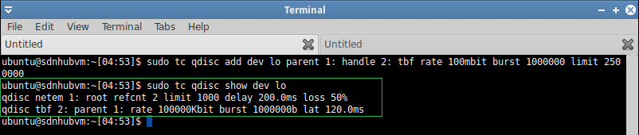  
</p>

## Reference
- [Linux Network Traffic Control](https://man7.org/linux/man-pages/man8/tc.8.html)
- [NetBeez Blog. How to use the Linux Traffic Control](https://netbeez.net/blog/how-to-use-the-linux-traffic-control/)
